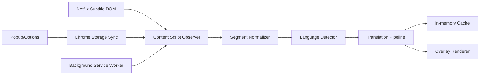

# SubBridge CN 技术方案文档（Netflix 日英字幕实时翻译为中文）

## 1. 文档目标

本文档用于指导 SubBridge CN Chrome 扩展的设计、开发、测试与发布。目标是在 Netflix 播放页面中，将日语或英语字幕实时翻译为中文，并在屏幕下方进行稳定显示。

约束条件：
- 完全免费可用（默认不依赖付费 API）
- 不绕过 DRM，不抓取视频流
- 只做客户端字幕辅助显示

## 2. 范围定义

### 2.1 MVP 范围

- 在 Netflix 播放页面识别字幕文本
- 检测字幕语言（英语/日语）
- 将字幕翻译为中文（简体）
- 在视频底部显示译文层
- 支持基础设置（开关、显示模式、字号、透明度、底部偏移）

### 2.2 非范围

- 离线导出整集字幕
- 字幕数据库云同步
- 账号系统与跨设备同步
- 影视级专业翻译质量承诺

## 3. 总体架构



模块分层：
- 页面层（Content Script）：字幕抓取、翻译调度、渲染
- 控制层（Background）：初始化默认配置
- 配置层（Popup + Options + Storage）：用户设置管理

## 4. 技术选型

- 扩展标准：Chrome Extension Manifest V3
- 语言：Vanilla JavaScript（MVP）
- 状态存储：chrome.storage.sync
- 免费翻译策略：
  - 主策略：在线免费引擎（MyMemory）
  - 兜底策略：本地词典替换与原文回退
- 渲染：DOM Overlay（fixed + pointer-events: none）

说明：MVP 以可用性优先，后续可演进到本地 WebAssembly 量化模型实现更强离线翻译。

## 5. 关键模块设计

## 5.1 字幕抓取模块

职责：
- 监听 Netflix 播放器字幕容器变化
- 读取当前可见字幕行
- 去重与节流，避免重复翻译

实现点：
- MutationObserver 监听 body 子树
- 多选择器策略（兼容 Netflix 页面结构波动）
- 句段合并（100-250ms 防抖）

输入：字幕文本原文
输出：标准化片段对象

片段对象结构：
- id: string（文本 hash）
- text: string
- timestamp: number
- lang: en | ja | unknown

## 5.2 语言检测模块

规则：
- 命中日文字符范围（平假名/片假名/常用汉字）优先判定为 ja
- 仅拉丁字符与常见英文标点判定为 en
- 其他为 unknown，按 en 流程处理

## 5.3 翻译管线模块

策略链：
1. 命中缓存直接返回
2. 根据设置决定翻译模式
3. 在线模式：请求免费接口
4. 本地模式：词典替换 + 短句规则
5. 失败回退：返回原文（标记）

缓存策略：
- 内存 LRU Map（默认 500 条）
- key: lang + text
- value: translatedText

超时策略：
- 单次翻译超时 1200ms
- 超时直接回退，不阻塞下一条字幕

## 5.4 显示层模块

渲染要求：
- 固定在屏幕底部中间区域
- 不拦截鼠标事件
- 响应用户样式设置
- 支持三种显示模式：
  - zh-only
  - bilingual
  - original-only

兼容策略：
- 提高 z-index，避免被播放器层遮挡
- 使用 text-shadow 增强可读性

## 5.5 设置与控制模块

配置项：
- enabled: boolean
- mode: online-free | local-free
- displayMode: zh-only | bilingual | original-only
- fontSize: number
- bottomOffset: number
- bgOpacity: number
- subtitleDelayMs: number（-500 ~ 500）
- mergeDebounceMs: number（80 ~ 320）
- showStatusBadge: boolean

交互：
- Popup：快速开关、模式切换
- Options：完整样式设置

## 5.6 已落地实现状态（2026-04-13）

- 已实现 Netflix 字幕 DOM 监听与多选择器回退
- 已实现字幕标准化、去重与拼句防抖
- 已实现日语/英语识别与免费翻译策略链（在线 + 本地回退）
- 已实现底部 Overlay 双语/中文/原文模式切换
- 已实现字幕延迟微调、状态徽标显示与自动清屏
- 已实现 Popup 与 Options 配置联动，存储于 chrome.storage.sync

## 6. 数据流与时序

字幕更新时序：
1. Observer 捕获字幕变化
2. 标准化与去重
3. 语言检测
4. 翻译请求（缓存优先）
5. Overlay 渲染
6. 下一轮更新

性能关键点：
- 对重复字幕严格去重
- 翻译并发限制为 1（串行）避免乱序
- 超时回退避免卡顿

## 7. 目录结构

```text
j2c/
  docs/
    TECHNICAL_SOLUTION.md
  src/
    background.js
    contentScript.js
    translator/
      translator.js
    styles/
      overlay.css
    popup/
      popup.html
      popup.js
      popup.css
    options/
      options.html
      options.js
      options.css
  manifest.json
  package.json
  README.md
```

## 8. Manifest 权限设计

必要权限：
- storage：保存用户设置
- activeTab：向当前页发送控制消息
- scripting：必要时注入脚本

主机权限：
- https://www.netflix.com/*
- https://api.mymemory.translated.net/*

风险控制：
- 权限最小化，不请求 tabs 全权限

## 9. 质量属性与指标

- 功能可用性：字幕识别成功率 > 90%（主流页面结构）
- 实时性：平均翻译渲染延迟 < 500ms（缓存命中 < 120ms）
- 稳定性：连续播放 2 小时无崩溃
- 可恢复性：接口失败时可自动回退原文

## 10. 测试方案

### 10.1 手工测试

- 场景 A：英文字幕剧集，开启翻译后是否稳定显示中文
- 场景 B：日文字幕剧集，是否能正确判定语言与翻译
- 场景 C：切换显示模式与字号，是否即时生效
- 场景 D：断网场景，是否回退原文并不中断渲染

### 10.2 回归测试清单

- Netflix 页面刷新后自动恢复状态
- 设置在浏览器重启后保持

## 11. 安全与合规

- 不采集账号、播放历史、视频内容
- 不将字幕持久化到远程服务器
- 仅在本地页面上做即时文本处理

## 12. 里程碑

- M1：项目脚手架 + 字幕抓取 + Overlay 基础显示
- M2：翻译管线 + 缓存 + 配置系统
- M3：样式完善 + 稳定性优化
- M4：发布文档与 Chrome 商店素材

## 13. 后续演进建议

- 接入浏览器端离线 NMT（WASM）提升免费离线能力
- 增加术语表与上下文拼句翻译
- 支持简体/繁体切换与术语风格偏好

## 14. 技术方案完成清单（优先验收）

- 已完成：字幕抓取（MutationObserver + 多选择器）
- 已完成：标准化片段对象（id/text/timestamp/lang）
- 已完成：语言检测（ja/en）与 unknown 按 en 流程处理
- 已完成：翻译策略链（缓存 -> 模式分流 -> 在线免费 -> 本地回退）
- 已完成：单次翻译超时控制（1200ms）
- 已完成：显示层三模式（zh-only/bilingual/original-only）
- 已完成：样式参数控制（fontSize/bottomOffset/bgOpacity）
- 已完成：字幕延迟微调（subtitleDelayMs）
- 已完成：拼句防抖（mergeDebounceMs）
- 已完成：状态徽标开关（showStatusBadge）
- 已完成：Popup + Options + storage.sync 配置联动
